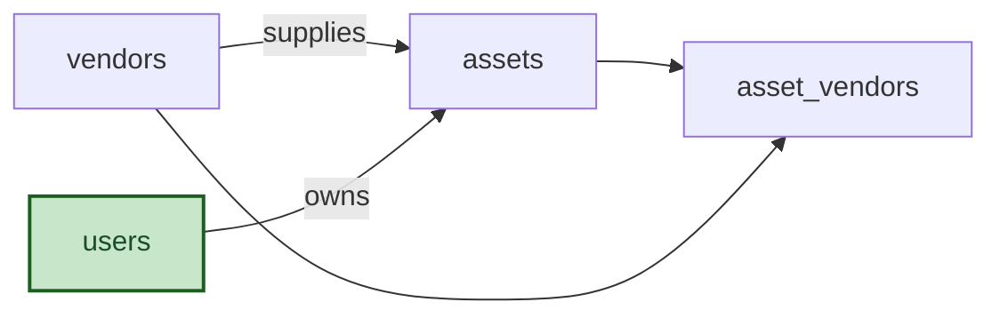

# Demo Ops: Semantic Model

## 1. Overview

Demo operations tracker.

## 2. Entity summary

| # | Table name | Singular label | Purpose |
|---|---|---|---|
| 1 | `vendors` | Vendor | A supplier the team buys assets from. |
| 2 | `assets` | Asset | A physical or virtual item the team tracks. |
| 3 | `asset_vendors` | Asset Vendor | Links an asset to a secondary vendor. |
| 4 | `users` | User | Users and agents |

### Entity-relationship diagram

## 3. Entities

### 3.1 `vendors` - Vendor

**Plural label:** Vendors
**Label column:** `vendor_name`
**Audit log:** no
**Catalog entity code:** `vendors`
**Entity type:** catalog
**Description:** A supplier the team buys assets from.

**Fields**

| Field name | Format | Required | Label | Description | Reference / Notes |
|---|---|---|---|---|---|
| `vendor_name` | `string` | yes | Vendor Name | | `label_column` |
| `website` | `multiline` | no | Website | | |

**Relationships**

- A `vendors` record may have many `assets` (1:N, via `assets.vendor_id`).
- `vendors` ↔ `assets` is many-to-many through the `asset_vendors` junction table.

### 3.2 `assets` - Asset

**Plural label:** Assets
**Label column:** `asset_tag`
**Audit log:** yes
**Catalog entity code:** `assets`
**Entity type:** operational_workflow
**Description:** A physical or virtual item the team tracks. Created when procured.

**Fields**

| Field name | Format | Required | Label | Description | Reference / Notes |
|---|---|---|---|---|---|
| `asset_tag` | `string` | yes | Asset Tag | | `label_column`, `unique` |
| `workflow_state` | `enum` | yes | Status | | enum_values: `in_stock`, `deployed`, `retired`; default: "in_stock" |
| `vendor_id` | `reference` | yes | Vendor | | → `vendors` (N:1), relationship_label: "supplies" |
| `owner_id` | `reference` | no | Owner | | → `users` (N:1), relationship_label: "owns" |
| `purchase_cost` | `number` | no | Purchase Cost | Net of tax. | precision: 2 |
| `notes` | `multiline` | no | Notes | | |

**Relationships**

- An `assets` record belongs to one `vendors` via `vendor_id` (N:1, required, restrict on delete).
- An `assets` record may belong to one `users` via `owner_id` (N:1, optional, clear on delete).
- `assets` ↔ `vendors` is many-to-many through the `asset_vendors` junction table.

### 3.3 `asset_vendors` - Asset Vendor

**Plural label:** Asset Vendors
**Audit log:** no
**Catalog entity code:** `asset_vendors`
**Entity type:** junction
**Description:** Links an asset to a secondary vendor.

**Fields**

| Field name | Format | Required | Label | Description | Reference / Notes |
|---|---|---|---|---|---|
| `asset_id` | `parent` | yes | Asset | | ↳ `assets` (N:1) |
| `vendor_id` | `parent` | yes | Vendor | | ↳ `vendors` (N:1) |

**Relationships**

- Each `asset_vendors` links one `assets` to one `vendors` (junction, both legs cascade on delete).

### 3.4 `users` - User

**Plural label:** Users
**Label column:** `email`
**Reconciliation:** reuse-from semantius_builtin.users
**Description:** Users and agents

**Relationships**

- An `users` record may have many `assets` (1:N, via `assets.owner_id`).

---

## 4. Relationship summary

| From | Field | To | Cardinality | Kind | fk_format | Delete behavior |
|---|---|---|---|---|---|---|
| `assets` | `vendor_id` | `vendors` | N:1 | reference | reference | restrict |
| `assets` | `owner_id` | `users` | N:1 | reference | reference | clear |
| `asset_vendors` | `asset_id` | `assets` | N:1 | junction | parent | cascade |
| `asset_vendors` | `vendor_id` | `vendors` | N:1 | junction | parent | cascade |

## 5. Enumerations

### `assets.workflow_state`
- `in_stock`
- `deployed`
- `retired`

## 6. Cross-model link suggestions

_(none: live extraction is reverse-engineering; every cross-module FK already exists as a §3 reference)_

### Outbound handoffs

_(none: not extracted from live state by semantius-optimizer; carried from the blueprint when one exists)_

### Inbound handoffs

_(none: not extracted from live state by semantius-optimizer; carried from the blueprint when one exists)_

## 7. Open questions

### 7.1 🔴 Decisions needed (blockers)

_(none: reverse-engineered from a live module; nothing blocks redeployment)_

### 7.2 🟡 Future considerations (deferred scope)

_(none: reverse-engineered from a live module)_

## 8.1 Permissions catalog

| permission | tier | description | included in `:admin`? | reconciliation |
| --- | --- | --- | --- | --- |
| `demo-ops:read` | baseline-read | Read access to every record in the module. | ✓ | (none) |
| `demo-ops:manage` | baseline-manage | Create and edit records in the module. | ✓ | (none) |

## 8.2 Business rules

_(none: access_scope is basic, so no permission-gated business rules are authored)_

## 9. Governance

### 9.1 `DEMO-OPS`

**Baseline roles:**

| role | baseline grant | origin | catalog role code | reconciliation |
| --- | --- | --- | --- | --- |
| `demo_ops_viewer` | `demo-ops:read` | model | | ♻ exists |
| `demo_ops_manager` | `demo-ops:manage` | model | | ♻ exists |

**Permission hierarchy:**

| permission | includes | reconciliation |
| --- | --- | --- |
| `demo-ops:manage` | `demo-ops:read` | ♻ exists |

**Processes:** _(none: access_scope is basic, no Processes catalog is authored)_

### 9.2 Functional ownership and default grants

_(none: access_scope is basic, no functional-ownership rows are authored)_
