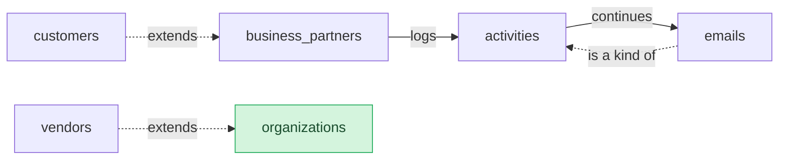

# Partners: Semantic Model

## 1. Overview

Partners and their timeline.

## 2. Entity summary

| # | Table name | Singular label | Purpose |
|---|---|---|---|
| 1 | `activities` | Activity | Anything logged on a business partner's timeline. |
| 2 | `business_partners` | Business Partner | A company or person the business deals with. |
| 3 | `customers` | Customer | A business partner the business sells to. |
| 4 | `emails` | Email | An email on a business partner's timeline. |
| 5 | `vendors` | Vendor | A company the business buys from, kept once as an organization. |
| 6 | `organizations` | Organization | A company, kept once across modules. |

### Entity-relationship diagram

## 3. Entities

### 3.1 `activities` - Activity

**Plural label:** Activities
**Label column:** `subject`
**Key type:** typeid
**Key prefix:** act
**Audit log:** no
**Catalog entity code:** `activities`
**Entity type:** operational_record
**Description:** Anything logged on a business partner's timeline.

**Fields**

| Field name | Format | Required | Label | Description | Reference / Notes |
|---|---|---|---|---|---|
| `subject` | `string` | yes | Subject | | `label_column` |
| `business_partner_id` | `reference` | yes | Business Partner | | → `business_partners` (N:1), relationship_label: "logs" |

**Relationships**

- An `activities` record belongs to one `business_partners` via `business_partner_id` (N:1, required, restrict on delete).
- An `activities` record may have many `emails` (1:N, via `emails.thread_id`).

### 3.2 `business_partners` - Business Partner

**Plural label:** Business Partners
**Label column:** `partner_name`
**Key type:** typeid
**Key prefix:** bp
**Audit log:** no
**Catalog entity code:** `business_partners`
**Entity type:** operational_record
**Description:** A company or person the business deals with.

**Fields**

| Field name | Format | Required | Label | Description | Reference / Notes |
|---|---|---|---|---|---|
| `partner_name` | `string` | yes | Partner Name | | `label_column` |
| `tax_id` | `multiline` | no | Tax ID | | |

**Relationships**

- A `business_partners` record may have many `activities` (1:N, via `activities.business_partner_id`).

### 3.3 `customers` - Customer

**Plural label:** Customers
**Key type:** has_a
**Based on:** `business_partners`
**Audit log:** no
**Catalog entity code:** `customers`
**Entity type:** operational_record
**Description:** A business partner the business sells to.

**Fields**

| Field name | Format | Required | Label | Description | Reference / Notes |
|---|---|---|---|---|---|
| `customer_tier` | `enum` | yes | Customer Tier | | enum_values: `standard`, `kam`; default: "standard" |

**Relationships**

- A `customers` record extends one `business_partners` record and shares its key (has_a).

### 3.4 `emails` - Email

**Plural label:** Emails
**Key type:** is_a
**Key prefix:** eml
**Based on:** `activities`
**Audit log:** no
**Catalog entity code:** `emails`
**Entity type:** operational_record
**Description:** An email on a business partner's timeline.

**Fields**

| Field name | Format | Required | Label | Description | Reference / Notes |
|---|---|---|---|---|---|
| `from_address` | `email` | yes | From | | |
| `thread_id` | `reference` | no | Thread | | → `activities` (N:1), relationship_label: "continues" |

**Relationships**

- An `emails` record is a kind of `activities` and shares its key (is_a).
- An `emails` record may belong to one `activities` via `thread_id` (N:1, optional, clear on delete).

### 3.5 `vendors` - Vendor

**Plural label:** Vendors
**Key type:** has_a
**Based on:** `organizations`
**Audit log:** no
**Catalog entity code:** `vendors`
**Entity type:** operational_record
**Description:** A company the business buys from, kept once as an organization.

**Fields**

| Field name | Format | Required | Label | Description | Reference / Notes |
|---|---|---|---|---|---|
| `payment_terms_days` | `integer` | no | Payment Terms | | |

**Relationships**

- A `vendors` record extends one `organizations` record and shares its key (has_a).

### 3.6 `organizations` - Organization

**Plural label:** Organizations
**Label column:** `org_name`
**Reconciliation:** reuse-from crm.organizations
**Description:** A company, kept once across modules.

---

## 4. Relationship summary

| From | Field | To | Cardinality | Kind | fk_format | Delete behavior |
|---|---|---|---|---|---|---|
| `activities` | `business_partner_id` | `business_partners` | N:1 | reference | reference | restrict |
| `emails` | `thread_id` | `activities` | N:1 | reference | reference | clear |

## 5. Enumerations

### `customers.customer_tier`
- `standard`
- `kam` - Key account

## 6. Cross-model link suggestions

_(none: live extraction is reverse-engineering; every cross-module FK already exists as a §3 reference)_

### Outbound handoffs

_(none: not extracted from live state by semantius-optimizer; carried from the blueprint when one exists)_

### Inbound handoffs

_(none: not extracted from live state by semantius-optimizer; carried from the blueprint when one exists)_

## 7. Open questions

### 7.1 🔴 Decisions needed (blockers)

_(none: reverse-engineered from a live module; nothing blocks redeployment)_

### 7.2 🟡 Future considerations (deferred scope)

_(none: reverse-engineered from a live module)_

## 8.1 Permissions catalog

| permission | tier | description | included in `:admin`? | reconciliation |
| --- | --- | --- | --- | --- |
| `partners:read` | baseline-read | Read access to every record in the module. | ✓ | (none) |
| `partners:manage` | baseline-manage | Create and edit records in the module. | ✓ | (none) |

## 8.2 Business rules

_(none: access_scope is basic, so no permission-gated business rules are authored)_

## 9. Governance

### 9.1 `PARTNERS`

**Baseline roles:**

| role | baseline grant | origin | catalog role code | reconciliation |
| --- | --- | --- | --- | --- |
| `partners_viewer` | `partners:read` | model | | ♻ exists |
| `partners_manager` | `partners:manage` | model | | ♻ exists |

**Permission hierarchy:**

| permission | includes | reconciliation |
| --- | --- | --- |
| `partners:manage` | `partners:read` | ♻ exists |
| `partners:manage` | `crm:manage` | ♻ exists |

**Processes:** _(none: access_scope is basic, no Processes catalog is authored)_

### 9.2 Functional ownership and default grants

_(none: access_scope is basic, no functional-ownership rows are authored)_
